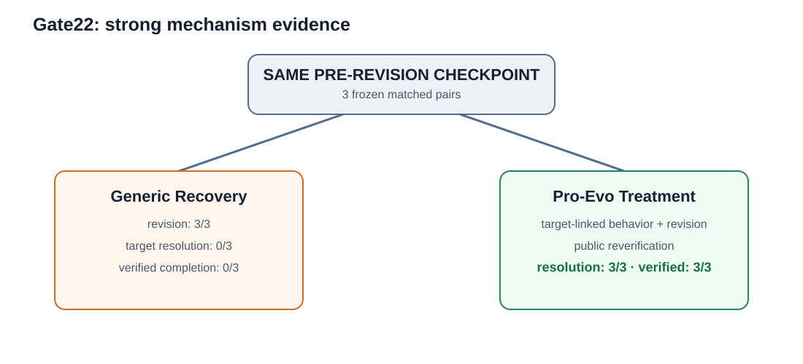
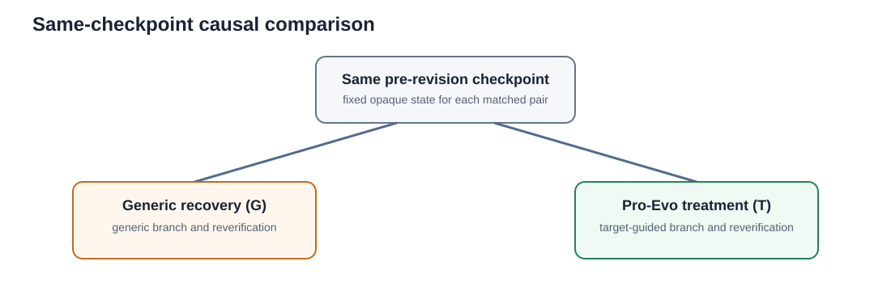

# Pro-Evo

## Process-Aware Agent Evaluation and Reliability Optimization

**Open Core and Public Evidence Release**

> **This is not the complete Pro-Evo implementation.** This repository publishes selected open-core abstractions, reproducible public evidence, experiment methodology, offline evidence replay, and reference examples. The full research runtime, production experiment infrastructure, private benchmark assets, provider integrations, and hidden evaluation infrastructure are not open-sourced.

## Why Pro-Evo

Final success is not necessarily reliable execution. A conventional evaluation often asks `task → agent → final score`. Pro-Evo makes the intermediate reasoning observable at the process level:

`execution → process evidence → reliability diagnosis → optimization target → targeted intervention → causal validation`

The goal is not a universal claim about agents; it is to test whether a process-aware intervention changes a defined, observable recovery outcome under a frozen causal protocol.

## Key result: Gate22

Under three prospectively frozen, same-checkpoint **pre-revision** comparisons, the Pro-Evo process-aware intervention produced complete target-linked recovery chains in all three treatment branches. Generic recovery controls also revised the workspace but failed to resolve the target in all three pairs.

| Frozen Gate22 comparison | Generic recovery (G) | Pro-Evo treatment (T) |
| --- | ---: | ---: |
| Matched pre-revision checkpoints | 3 | 3 |
| Target resolution | 0/3 | 3/3 |
| Verified completion | 0/3 | 3/3 |
| Strong mechanism traces | 0/3 | 3/3 |



## What Pro-Evo evaluates

Pro-Evo treats a process trace as evidence. It records public-safe process events, maps observed failure into a target with an observable success condition, and evaluates whether an intervention produces the target-linked behavior followed by public reverification. The open core supplies only the data abstractions and deterministic analysis needed to audit that chain.

## From evaluation to optimization


The full architecture is documented in [docs/architecture.md](docs/architecture.md), and the public methodology in [docs/methodology.md](docs/methodology.md).

## Same-checkpoint causal design

G and T start from the same opaque pre-revision checkpoint within each matched pair. This fixes the state before the branch decision and makes the observed post-branch differences inspectable. It does not prove broad generalization; it supports a causal proof-of-concept under this frozen condition.



## Strong mechanism evidence

For all three treatment branches, the public projection contains the complete chain:

`Public Failure → Process Diagnosis → Pre-revision Checkpoint → Same-checkpoint G/T → Target-guided Intervention → Observable Behavior Divergence → Post-treatment Corrective Revision → Public Reverification → Target Resolution → Verified Completion`

See [Gate22 evidence](evidence/gate22/), the [G/T comparison](evidence/gate22/gt-comparison.md), and the [evidence guide](docs/evidence-guide.md).

## Null results matter

Gate20 is intentionally public: generic and treatment recovery were both 2/2, yielding an effect of zero. The evidence records information redundancy, already-sufficient generic recovery, and a task-difficulty ceiling. It documents the scientific progression from null result to mechanism diagnosis, prospective redesign, refreeze, Gate21, and Gate22—rather than rerunning until a positive result appeared.


Gate21 is also public and correctly scoped: it showed a strong outcome result (G verified 0/3; T verified 3/3), but **moderate** behavioral attribution because the key revision lay in a shared pre-treatment prefix. Gate22 advances the checkpoint specifically to address that weakness.

## Open core

The open core can load sanitized public traces, read process events, reconstruct an optimization target abstraction, verify same-checkpoint identities, compute target resolution and verified completion, calculate the G/T aggregate, and run an offline replay. It intentionally excludes provider execution, orchestration, production controllers, benchmark runners, task source, hidden evaluators, and deployment machinery.

## Reproducing the public demo

No provider credential or network access is needed.

```bash
python -m pytest -q
python examples/evidence-replay/run.py
```

Expected Gate22 aggregate: 3 matched pairs; G target resolution and verified completion 0; T target resolution and verified completion 3; strong mechanism traces 3; public-only true; private CoT used false.

## Research integrity

The evidence is a sanitized projection, not a raw artifact dump. Read [docs/research-integrity.md](docs/research-integrity.md), [docs/limitations.md](docs/limitations.md), [docs/faq.md](docs/faq.md), and [CLAIM_BOUNDARY.md](CLAIM_BOUNDARY.md) before interpreting the result.

## What is not open-sourced

The complete research runtime, production experiment infrastructure, provider adapters and accounts, benchmark corpus and task repositories, private experiment artifacts, raw provider bodies, private reasoning, hidden tests/evaluators, expected or reference patches, credentials, and internal/company assets are excluded.

## License and release scope

This repository is an **Open Core and Public Evidence Release**. Only the explicitly identified Open Core software components are licensed as open-source software under Apache License 2.0. Original documentation is CC BY-NC 4.0; sanitized public research evidence and experiment-result figures are CC BY-NC-ND 4.0. See [LICENSE.md](LICENSE.md) for the path-scoped terms.

The complete Pro-Evo research runtime, production experiment infrastructure, private benchmark assets, provider integrations, and hidden evaluation infrastructure are not included or licensed.

## Citation

No author identity is asserted in this staging release. Citation metadata requires an approved public identity before publication.
