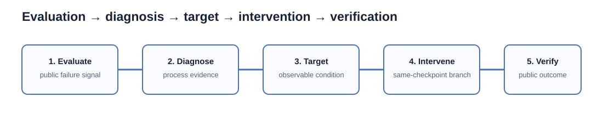
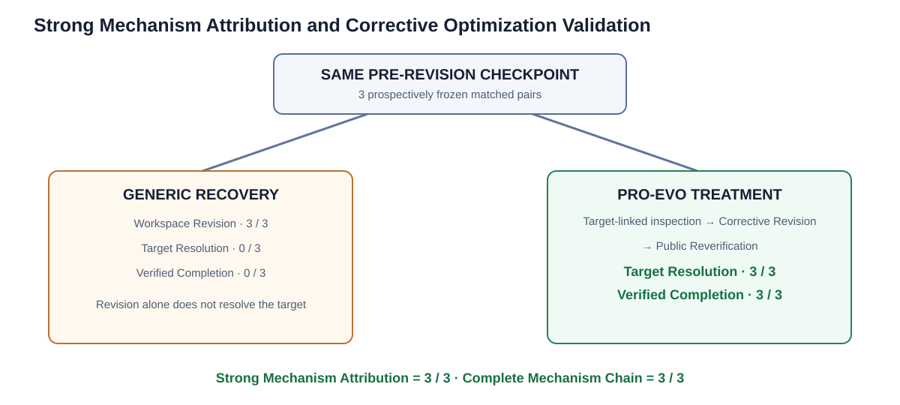
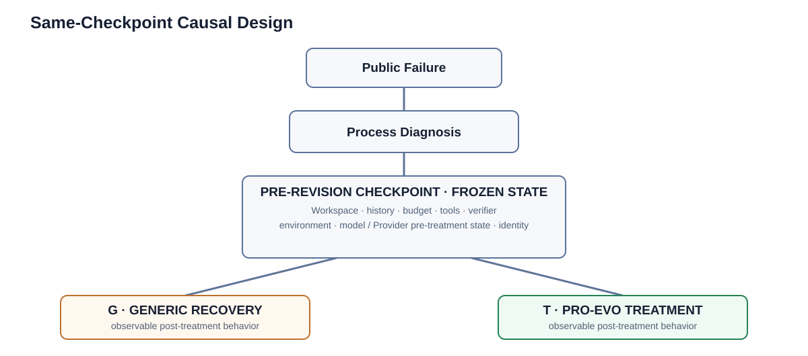
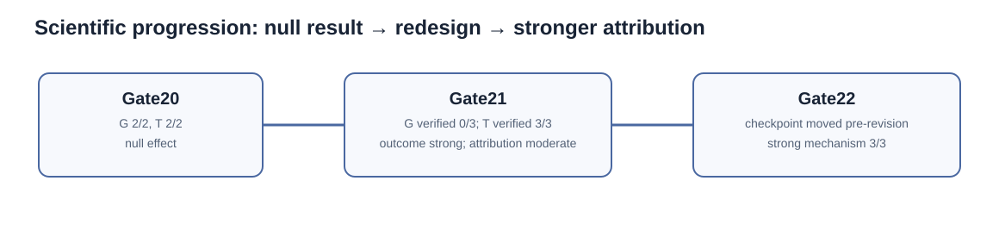
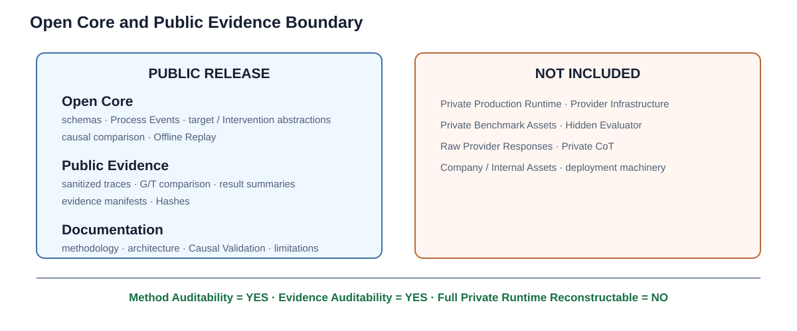

# Pro-Evo

## Process-Aware Agent Evaluation and Reliability Optimization

**Open Core and Public Evidence Release**

> **语言：** [English](README.md) · [简体中文](README.zh-CN.md)

> **Public-release boundary。** 这不是完整的 Pro-Evo implementation。本仓库公开选定的 Open Core abstraction、可复核的 Public Evidence、methodology、Offline Replay 与 reference example。完整 research Runtime、production experiment infrastructure、private Benchmark asset、Provider integration 与 Hidden Evaluator infrastructure 均未包含，也未被授予 license。

Pro-Evo 是一个以 evidence 为核心的 process-aware Agent Evaluation 与 Reliability Optimization framework。它不仅判断 Agent 是否成功，还利用 observable Execution evidence 理解 failure 与 Recovery，形成 Optimization Target，并通过 Causal Validation 检验 Intervention 是否真正改变 Reliability。

## 为什么需要 Pro-Evo

`Final success != reliable execution.` 传统 Agent Evaluation 通常是 `Task → Agent → Final Score`。它能回答“任务成功了吗？”，但通常不能审计 Agent 为什么失败、如何 Recovery、Recovery 是否利用了 observed failure evidence，或某个 Intervention 是否改变了 Recovery trajectory，而不是两次独立 sampling 的自然差异。

Pro-Evo 的链路是：

`Execution → Process Evidence → Reliability Diagnosis → Optimization Target → Targeted Intervention → Causal Validation → Reliability Optimization`



该图将 final-outcome score 与通向 Optimization decision 的 evidence-bearing path 区分开来。它描述的是 method model，而不是 private production Runtime topology。

## 如何阅读本仓库

1. 先阅读下方 strongest causal result。
2. 理解 Evaluation-to-Optimization model。
3. 检查 Same-checkpoint Causal Validation design。
4. 跟随从 Null Result 到 strong Mechanism Attribution 的 scientific progression。
5. 在本地 Replay Public Evidence。
6. 查看 Open Core / private boundary 与 claim limitation。

## Strong Mechanism Attribution and Corrective Optimization Validation

在三组 prospectively frozen、Same-checkpoint 的 **pre-revision** comparison 中，Pro-Evo Treatment 在全部 Treatment branch 形成 complete target-linked Recovery chain。两个 branch 都进行了 Workspace Revision。Causal distinction 不在于是否 revision，而在于 Treatment 形成了 target-linked post-treatment Recovery trajectory，并持续经过 Public Reverification、Target Resolution 与 Verified Completion。

| Frozen Same-checkpoint comparison | Generic Recovery (G) | Pro-Evo Treatment (T) |
| --- | ---: | ---: |
| Matched pre-revision Checkpoints | 3 | 3 |
| Workspace Revision | 3/3 | 3/3 |
| Target Resolution | 0/3 | 3/3 |
| Verified Completion | 0/3 | 3/3 |
| Strong Mechanism Attribution | 0/3 | 3/3 |
| Complete Mechanism Chain | 0/3 | 3/3 |



## Same-Checkpoint Causal Validation

每个 matched pair 从相同 opaque Pre-revision Checkpoint 开始。branch 前的 frozen protocol 固定 Workspace、conversation / Execution history、budget、Tool availability、Public Verifier、environment、model / Provider pre-treatment state 与 Checkpoint identity；改变的只有 post-checkpoint Intervention。

因此，在 frozen protocol 下，observable post-treatment behavioral divergence 可以被解释为 treatment Causal Effect，而不是两次独立 sampling 的自然差异。这不代表所有可能 confounding 都被自动消除，也不代表结果可超出本研究范围 generalize。



详细 comparison unit 见 [Causal Validation](docs/causal-validation.md)。[Strong Mechanism Evidence](evidence/gate22/) 继续使用 immutable Public Evidence path。

## Initial Target-Guided Recovery Validation：一次真实的 Null Result

首次 Target-Guided Recovery validation 被完整保留：Generic Recovery 与 Treatment 都达到 **2/2 effective recovery**，observed effect 为 **0**。其 public diagnosis 是 `INTERVENTION_INFORMATION_REDUNDANT`、`GENERIC_RECOVERY_ALREADY_SUFFICIENT` 与 `TASK_DIFFICULTY_CEILING`。

该结果没有被丢弃、没有反复 rerun 直到 positive，也没有在 outcome 后重定义 target。实际过程是 Null Result → Mechanism Diagnosis → prospective redesign → refrozen validation；这是 Research Integrity 的核心部分。

## Outcome-Level Causal Optimization Validation

下一次 frozen comparison 建立了 outcome difference：Generic Recovery 的 Verified Completion 为 **0/3**，Pro-Evo Treatment 为 **3/3**。因此，outcome-level Causal Effect 在该 protocol 下成立。

它的 Behavioral Attribution 是 **MODERATE**，而非 strong：critical Workspace Revision 已出现在 shared pre-treatment prefix。因此该 comparison 不能支持 strong revision-level Mechanism Attribution。这个 weakness 直接促成了最终 validation 的 pre-revision Checkpoint design。

## 从 Null Result 到 Corrective Optimization



最终 validation 将 Checkpoint 前移至 pre-revision state。Treatment 先于 observable inspection / Tool divergence、Corrective Revision、Public Reverification、Target Resolution 与 Verified Completion，形成 **3/3 complete Mechanism chain**。

## Open Core and Public Evidence Boundary

本发布的目标是 methodological auditability、evidence auditability 与 Offline Replay，而不是 full-system reproducibility。公开内容包括 typed schema、Process Event projection、target/intervention abstraction、minimal causal comparison utility、sanitized trace、manifest、Hash 与 documentation；不包括 private production Runtime、Provider infrastructure、private Benchmark asset、Hidden Evaluator、raw Provider response、Private CoT 与 company/internal asset。



[Architecture](docs/architecture.md) 说明 public method layer；[PUBLIC_RELEASE_SCOPE.md](PUBLIC_RELEASE_SCOPE.md) 与 [LICENSE.md](LICENSE.md) 说明 release / license boundary。

## Replay Public Evidence

无需 Provider credential，也无需网络访问：

```bash
python -m pytest -q
python examples/evidence-replay/run.py
```

deterministic Offline Replay 仅加载 sanitized Public Evidence，并重新计算：3 个 matched pair；G 的 Target Resolution / Verified Completion = 0/3；T = 3/3；Strong Mechanism Attribution = 3/3；`public_only = true`；`private_cot_used = false`。

## Research Integrity and Scope Note

当前 evidence 支持的是 frozen experimental condition 下的 **strong causal Proof-of-concept**。它不建立 universal Agent improvement、cross-model / cross-Benchmark generalization、production deployment effectiveness、industry-wide SOTA 或 statistical population-level superiority。

Public inference 不依赖 Private CoT。它基于 treatment timing、public Tool Call 与 result、Workspace Revision、Public Verifier event、Public Reverification、Target Resolution 和 Verified Completion。请阅读 [Research Integrity](docs/research-integrity.md)、[Limitations](docs/limitations.md)、[Evidence Guide](docs/evidence-guide.md)、[FAQ](docs/faq.md) 与 [Claim Boundary](CLAIM_BOUNDARY.md)。

## License

这是 Open Core and Public Evidence Release。明确列出的 Open Core software 使用 Apache-2.0；原创 documentation 使用 CC BY-NC 4.0；sanitized Public Evidence 与 experiment-result figure 使用 CC BY-NC-ND 4.0。路径范围规则见 [LICENSE.md](LICENSE.md)。

## Citation

本 release 不声明公开作者身份。Citation metadata 需在获得批准的公开身份后再补充。
