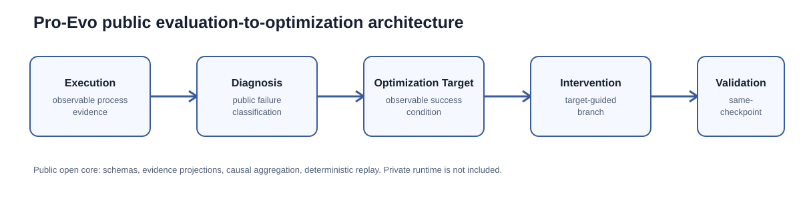

# Architecture

## Architecture Overview

Pro-Evo’s public architecture is a method architecture: it describes the minimum public layers needed to inspect a process-aware Evaluation claim and replay its evidence. It is deliberately not a diagram of the private production Runtime, controller topology, Provider orchestration, or Benchmark Harness.

## 1. Public Trace Schema

The Open Core `ProcessEvent` schema exposes only an event identity, ordering, event kind, and safe public projection. This gives a reviewer a stable observable Trace without publishing private state, credentials, raw Provider bodies, hidden prompts, or private reasoning.

## 2. Process-Event Projection

Process-event projection turns Runtime behavior into reviewable Process Evidence. The public projection preserves the ordering necessary to audit a recovery trajectory while removing private paths, task source, hidden Oracle outputs, and implementation details.

## 3. Reliability Diagnosis

Reliability Diagnosis links observable failure evidence to a public failure mechanism category. It does not expose an internal classifier or hidden Evaluator. Its role is to make the transition from Evaluation to Optimization inspectable.

## 4. Optimization Target Abstraction

An Optimization Target is not a prompt idea. It is an abstraction containing an observable failure condition and an observable resolution condition. This lets a reviewer distinguish a generic Workspace Revision from Target Resolution.

## 5. Intervention Abstraction

The public release represents an Intervention as a target-linked branch of a causal comparison. A Generic Recovery control can also revise the Workspace; the relevant question is whether the post-treatment behavior reaches the target-linked, publicly verified outcome.

## 6. Same-Checkpoint Pair Representation

Each matched pair records one opaque Pre-revision Checkpoint and two branches: Generic Recovery and Pro-Evo Treatment. The shared identity defines the public causal unit. It holds the pre-branch state fixed without exposing the private Runtime state itself.

## 7. Offline Causal Aggregation

The Offline Replay reads sanitized JSON evidence, checks Same-checkpoint identity, and aggregates Target Resolution, Verified Completion, and complete Mechanism-chain counts. It needs no Provider credential, network call, private CoT, or hidden Evaluator.

## 8. Architecture Boundary

The public architecture supports method auditability, evidence auditability, and deterministic Offline Replay. It intentionally cannot reconstruct the complete private production implementation. See [PUBLIC_RELEASE_SCOPE.md](../PUBLIC_RELEASE_SCOPE.md) and [Causal Validation](causal-validation.md).
